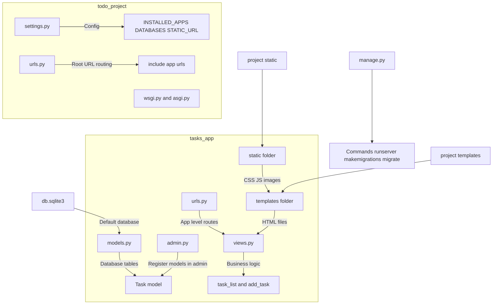
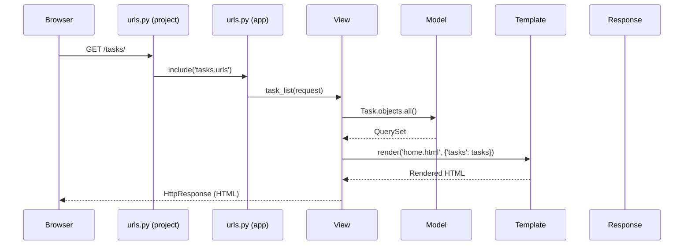

<!-- Here is a **modern, attractive, well-structured, and recruiter/portfolio-friendly** `README.md` for a Django learning/tutorial repository.  -->
<!-- It includes everything from your guide, adds visual appeal (badges, emojis, Mermaid diagrams, code snippets with syntax highlighting, tables, and clear sections), and explains concepts in a clean, flowing way.-->
<!-- This is a hidden comment -->


<div align="center">

  <h1>🚀 Django From Zero to Hero</h1>

  <p>
    <strong>A complete, beginner-to-intermediate guide to understanding and building real Django applications</strong><br>
    From installation → MVT architecture → real Todo app → request lifecycle
  </p>

  <!-- Badges -->
  <p>
    
    
    
    
  </p>

  <br>

  
  
  

</div>

## 📖 Why This Repository?

This is **not just another tutorial** — it's a **structured deep-dive** into how Django really works under the hood.

You will learn:

- How Django processes every single request
- How files & folders interact
- Why MVT is different from MVC
- How migrations actually change your database
- How to go from zero code → working Todo app in ~30 minutes

Perfect for:  
✅ Beginners starting Django  
✅ Intermediate developers wanting to understand internals  
✅ Interview prep (common Django system design questions)

## 🌟 Quick Start – Build a Todo App in 10 Minutes


```bash
# 1. Create & activate virtual environment
python -m venv venv
source venv/bin/activate    # Linux/Mac
venv\Scripts\activate       # Windows

# 2. Install Django
pip install django

# 3. Create project & app
django-admin startproject todo_project
cd todo_project
python manage.py startapp tasks

# 4. Run development server
python manage.py runserver
```

→ Open http://127.0.0.1:8000/

## 📂 Project & App Structure – Visualized



## ⚡ Django Request Lifecycle (Deep Dive)



## 🛠 Core Django Components

| Component       | File(s)              | Purpose                              | Key Commands / Concepts                     |
|-----------------|----------------------|--------------------------------------|---------------------------------------------|
| **Project**     | manage.py, settings.py, urls.py | Overall configuration & entry point  | `startproject`, `runserver`                 |
| **App**         | models.py, views.py, urls.py | Reusable module (blog, todo, users)  | `startapp`, add to `INSTALLED_APPS`         |
| **Model**       | models.py            | Database table definition            | `makemigrations`, `migrate`                 |
| **View**        | views.py             | Handles request → response logic     | FBV / CBV, `render()`, `redirect()`         |
| **Template**    | templates/*.html     | HTML + Django Template Language      | `{{ variable }}`, ``, `` |
| **URL Routing** | urls.py              | Maps URL → View                      | `path()`, `include()`                       |
| **Admin**       | admin.py             | Auto-generated CRUD interface        | `admin.site.register(Model)`                |
| **Migrations**  | migrations/000X_*.py | Track & apply DB schema changes      | `makemigrations`, `migrate`                 |

## 🏗 Step-by-Step: Building a Real Todo App

### 1. Model (tasks/models.py)

```python
from django.db import models

class Task(models.Model):
    title       = models.CharField(max_length=200)
    completed   = models.BooleanField(default=False)
    created_at  = models.DateTimeField(auto_now_add=True)

    def __str__(self):
        return self.title
```

### 2. Make & Apply Migrations

```bash
python manage.py makemigrations
python manage.py migrate
```

### 3. Register in Admin (tasks/admin.py)

```python
from django.contrib import admin
from .models import Task

admin.site.register(Task)
```

### 4. Views & URL Routing (tasks/views.py + urls.py)

```python
# views.py
from django.shortcuts import render, redirect
from .models import Task

def task_list(request):
    tasks = Task.objects.all()
    return render(request, 'tasks/home.html', {'tasks': tasks})

def add_task(request):
    if request.method == "POST":
        title = request.POST.get("title")
        Task.objects.create(title=title)
        return redirect("task_list")
    return render(request, 'tasks/home.html')
```

```python
# tasks/urls.py
from django.urls import path
from . import views

urlpatterns = [
    path('', views.task_list, name='task_list'),
    path('add/', views.add_task, name='add_task'),
]
```

```python
# project/urls.py
from django.contrib import admin
from django.urls import path, include

urlpatterns = [
    path('admin/', admin.site.urls),
    path('', include('tasks.urls')),
]
```

### 5. Template (templates/tasks/home.html)

```html
<!DOCTYPE html>
<html lang="en">
<head>
    <meta charset="UTF-8">
    <title>Todo App</title>
    <style>
        body { font-family: Arial; max-width: 600px; margin: 40px auto; }
        .task { padding: 10px; border-bottom: 1px solid #eee; }
        .completed { text-decoration: line-through; color: #888; }
    </style>
</head>
<body>
    <h1>📝 My Todo List</h1>

    <form method="post" action="">
        
        <input type="text" name="title" placeholder="Add a new task..." required>
        <button type="submit">Add</button>
    </form>

    <ul>
        
            <li class="task completed">
                {{ task.title }} — {{ task.created_at|date:"d M Y" }}
            </li>
        
            <li>No tasks yet. Add one above!</li>
        
    </ul>
</body>
</html>
```

## 🔥 Most Important Django Commands

```bash
# Project & App
django-admin startproject myproject
python manage.py startapp myapp

# Server & DB
python manage.py runserver
python manage.py makemigrations
python manage.py migrate
python manage.py createsuperuser

# Utils
python manage.py shell
python manage.py collectstatic
```

## 🎯 Why Choose Django in 2026?

- **Batteries included** → ORM, Auth, Admin, Forms, Security
- **Convention over configuration** → Less decision fatigue
- **Huge ecosystem** → Django REST Framework, Wagtail, Django Channels
- **Scalable** → Instagram, Pinterest, Disqus, Bitbucket run on Django

## 📚 Next Steps / Advanced Topics

- Class-Based Views (ListView, CreateView...)
- Django REST Framework → APIs
- Authentication (Login, Logout, Custom User)
- Django Channels → WebSockets / real-time
- Deployment (Docker, Gunicorn, Nginx, Railway/Fly.io)

Want to see **internal Django middleware flow**, **signal system**, or **how CSRF really works**?  
Let me know — I can add deep-dive sections!

---

⭐ If this helped you understand Django better — give it a star!  
🐛 Found a typo or want to improve something? Feel free to open a PR.

Happy coding! 🐍
```

### Tips for even better look:

- Add screenshots of:
  - admin panel
  - todo list page
  - terminal running migrations
  → Put them in `/screenshots/` folder and link like ``

- Use GitHub Actions badge if you add tests/CI
- Change colors in badges if you prefer different theme

Let me know if you want:

- Dark mode optimized version
- REST API version of Todo
- Deployment section (Docker + Render/Railway)
- More Mermaid diagrams (e.g., middleware stack)

This README should look **professional, clear, and attractive** on GitHub. Good luck with your Django journey! 🚀
